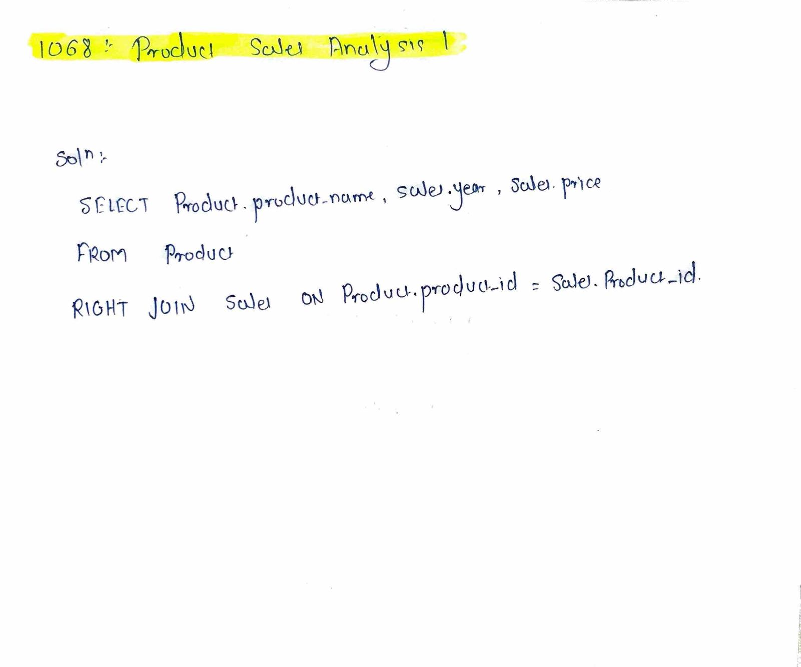

# LeetCode 1068 – Product Sales Analysis I

**Difficulty:** Easy  
**Topic:** SQL, Join  

---

## Problem Statement
Table: `Sales`

| Column Name | Type |
|------------|------|
| sale_id | int |
| product_id | int |
| year | int |
| quantity | int |
| price | int |

Table: `Product`

| Column Name | Type |
|------------|------|
| product_id | int |
| product_name | varchar |

Write an SQL query to report the **product_name**, **year**, and **price** for each sale.

Return the result table in **any order**.

---

## Approach
- Use an **INNER JOIN** between `Sales` and `Product`
- Join both tables using `product_id`
- Select required columns from both tables:
  - `product_name` from `Product`
  - `year` and `price` from `Sales`

---

## Algorithm
1. Select `product_name`, `year`, and `price`
2. Join `Sales` table with `Product` table
3. Use `product_id` as the joining condition
4. Return the result set

---

## Complexity
- **Time:** O(n)  
- **Space:** O(1)

---

## Code
See `solution.sql`

---

## Handwritten Notes

