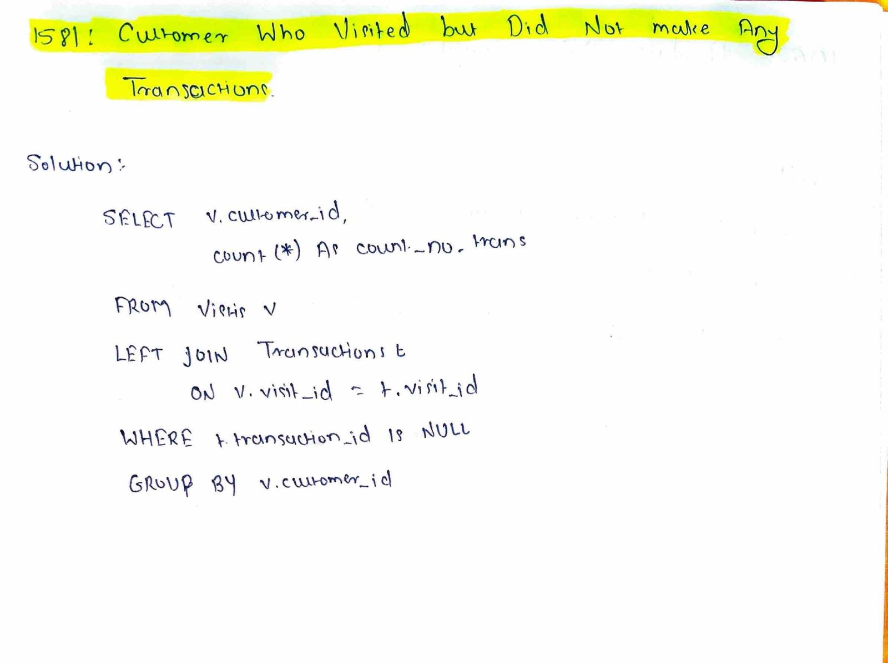

# LeetCode 1581 – Customer Who Visited but Did Not Make Any Transactions

## Difficulty
Easy

## Topic
SQL, LEFT JOIN

## Examples

### Example 1

**Visits**
| visit_id | customer_id |
|----------|-------------|
| 1 | 23 |
| 2 | 9 |
| 3 | 30 |
| 4 | 30 |

**Transactions**
| transaction_id | visit_id |
|----------------|----------|
| 10 | 1 |
| 11 | 2 |

**Output**
| customer_id | count_no_trans |
|-------------|----------------|
| 30 | 2 |

---

## Key Insight
We need to find visits that **do not have a matching transaction**.  
This requires keeping all visit records and identifying those without a corresponding entry in the `Transactions` table.

---

## Approach
- Use a `LEFT JOIN` between `Visits` and `Transactions` on `visit_id`
- Filter records where the transaction does not exist
- Group results by `customer_id`
- Count such visits for each customer

---

## Algorithm
1. Join `Visits` with `Transactions` using `LEFT JOIN`
2. Filter rows where transaction is missing
3. Group by `customer_id`
4. Count visits per customer
5. Return the result

---

## Complexity
- **Time Complexity:** O(n)
- **Space Complexity:** O(1)

---

## Code Reference
See `solution.sql`

---

## Handwritten Notes

