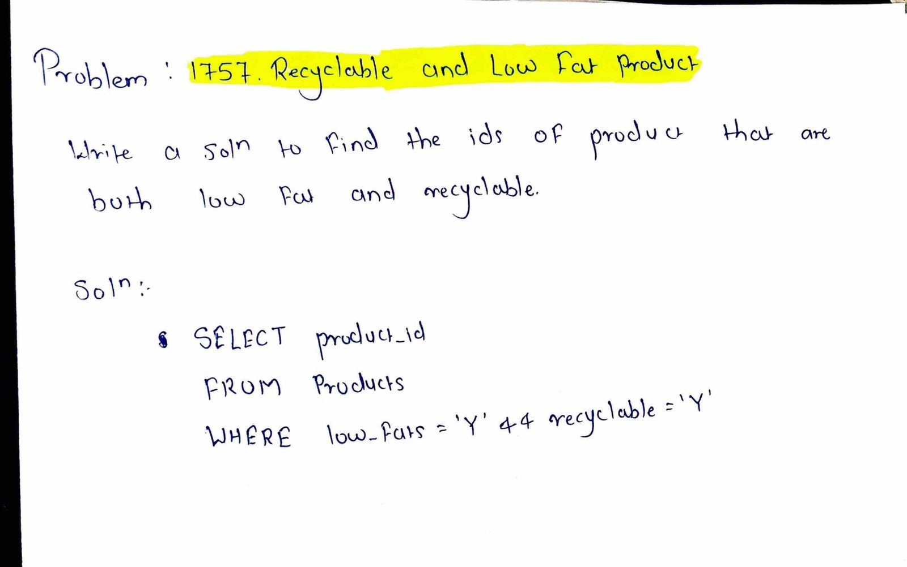

# LeetCode 1757 – Recyclable and Low Fat Products

**Difficulty:** Easy  
**Topic:** SQL, WHERE clause  

## Problem Statement
Find the IDs of products that are both **low fat** and **recyclable** from the `Products` table.

## Approach
- Use `SELECT` to fetch `product_id`
- Apply `WHERE` condition to filter:
  - `low_fats = 'Y'`
  - `recyclable = 'Y'`

## Complexity
- Time: O(n)
- Space: O(1)

## Code
See `solution.sql`

## Handwritten Notes

