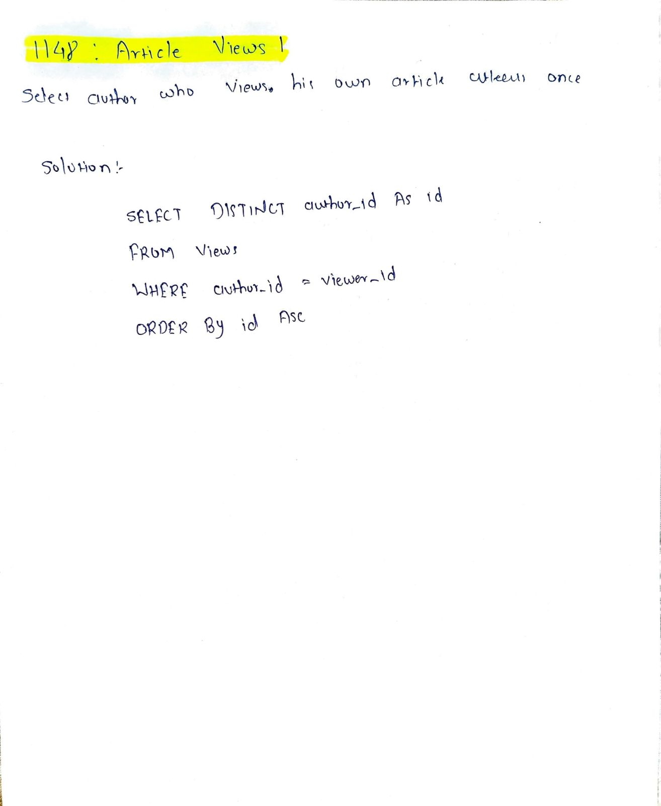

# LeetCode 1148 – Article Views I

**Difficulty:** Easy  
**Topic:** SQL, Filtering  

## Problem Statement
You are given a table `Views` that records article views.

Each row contains the article id, author id, viewer id, and view date.

Write an SQL query to find all authors who have viewed **at least one of their own articles**.

Return the result table:
- with a single column named `id`
- sorted by `id` in ascending order

---

## Approach
- Filter rows where the author is the same as the viewer
- Select the author id from those rows
- Use `DISTINCT` to avoid duplicate authors
- Sort the result in ascending order

---

## Algorithm
1. Select records where `author_id = viewer_id`
2. Extract `author_id` as `id`
3. Remove duplicates
4. Order the result by `id`

---

## Complexity
- **Time Complexity:** O(n)
- **Space Complexity:** O(1)

---

## Code
See `solution.sql`

---

## Handwritten Notes

