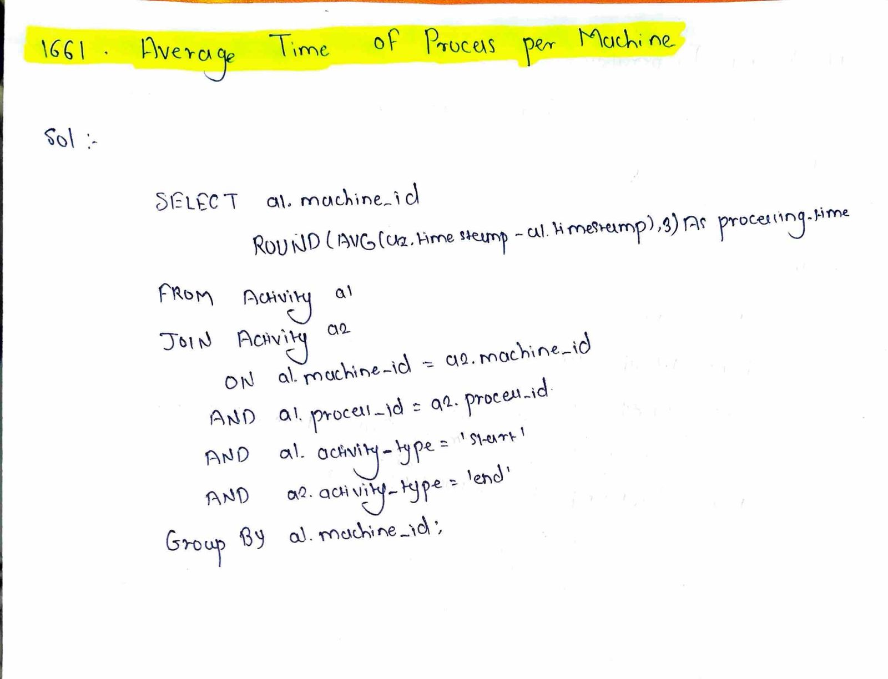

# LeetCode 1661 – Average Time of Process per Machine

**Difficulty:** Easy  
**Topic:** SQL, Aggregation  

---

## Problem Statement
You are given a table `Activity` that stores the start and end times of processes running on machines.

Each row contains:
- `machine_id`
- `process_id`
- `activity_type` (`start` or `end`)
- `timestamp`

Each process:
- Has exactly one `start` record
- Has exactly one `end` record
- Runs on the same machine

The processing time of a process is calculated as:

end_time - start_time

Write an SQL query to find the **average processing time per machine**, rounded to **3 decimal places**.

The result can be returned in any order.

---

## Example

**Input:**
machine 0 → processes with times (5 − 1) and (10 − 6)  
machine 1 → process with time (7 − 2)

**Output:**
machine 0 → 4.000  
machine 1 → 5.000  

---

## Key Insight
- Start and end times are stored in separate rows
- Processing time requires pairing start and end records of the same process
- Final result must be aggregated per machine

---

## Approach
1. Pair start and end activities of the same process
2. Calculate processing time
3. Group results by machine
4. Compute the average
5. Round to 3 decimal places

---

## Algorithm
1. Identify matching start and end records
2. Ensure rows belong to the same machine and process
3. Subtract start time from end time
4. Group by machine
5. Calculate average processing time

---

## Complexity
- **Time Complexity:** O(n)
- **Space Complexity:** O(1)

---

## Code
See `solution.sql`

---

## Handwritten Notes

