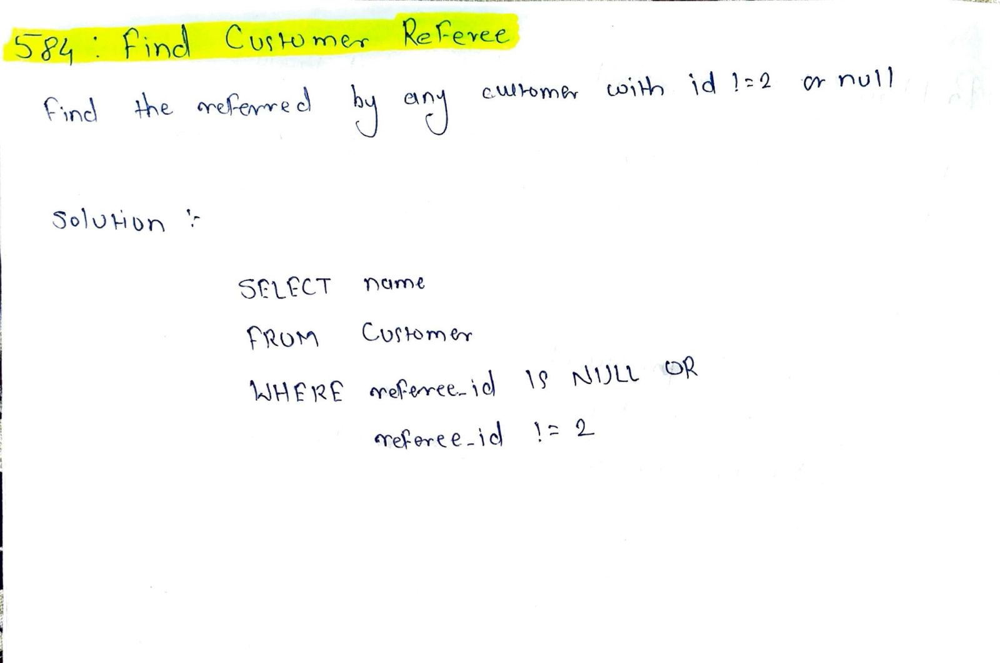

# LeetCode 584 – Find Customer Referee

**Difficulty:** Easy  
**Topic:** SQL, Filtering  

## Problem Statement
You are given a table `Customer`.

Write an SQL query to find the **names of customers who are not referred by the customer with id = 2**.

Customers with `NULL` as `referee_id` are considered as not referred by customer 2.

## Approach
- Select the `name` column from the `Customer` table
- Include customers whose `referee_id`:
  - is `NULL`
  - OR is not equal to `2`
- Explicitly handle `NULL` values because SQL does not compare `NULL` using `!=`

## Complexity
- Time: O(n)
- Space: O(1)

## Code
See `solution.sql`

## Handwritten Notes

